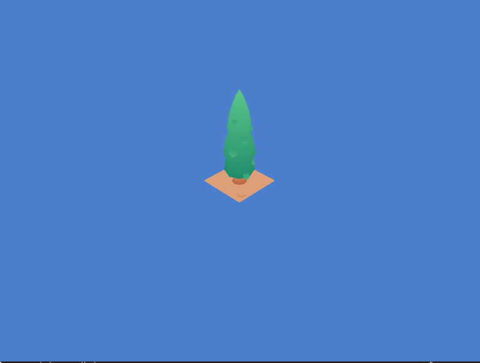

## Another game development from scratch project

Here is another attempt at making a game from scratch as a learning exercise for getting better at OpenGL. This time the target involves making a fully working game with physics and audio. 

We are using : 

- **SDL2** : For window context handling
- **glew** : For openGL context handling and loading all openGL function pointers.
- **Assimp** : mesh loading library (3rd party would be prefered)
- **TBD** : physics engine (3rd party would be prefered)
- **TBD** : audio library (3rd party would be prefered)

#### Thoughts right now

// 2024--3-8
Added multipart texture rendering for 

// 2024-03-02
Added multi part mesh loading (NOTE: Please confirm if there are animations involed with the character-soldier model).

// 2024-02-21
Fixed the issues which was causing the triangle colors to not show up when the projection, model, and view matrix were bound

// 2024-02-07
Current progress has made me extremely bored of what I am doing. Since I have an Idea in my head which I want to work on, I will leave the complicated model loading and texture loading and texture mapping for the time when I am willing to do something fun. In the mean time let's write a renderer which can render a cube easily on the screen.

#### Progress 

Rendering is done in the game: 

##### Development

- [x] Setting up basic platform layer which creates SDL window with opengl 
- [x] setting up keyboard and mouse input handling 
- [x] Setting up basic shader
- [x] Setting up basic vertex renderer 
- [x] Setting up camera is done.
- [x] Setting up a basic camera with motion avaliable 
- [x] Making a descision about what the game should be like (2D/3D/Isometric)
- [x] Setting up basic texture renderer
- [x] Setting up basic mesh loading (would be preferable to do with a library due to previous experience)
- [x] Loading multi-part mesh models from assimp
- [x] Loading mesh related information from model file instead of hard-loading it directly
- [ ] Setting up Animation loading and rendering ????????? 
- [ ] Settign up basic lighting
- [ ] Setting up a scene where multiple entities are present 

##### Maintainance

- [x] Bug detected in keyboard press tracking system
- [ ] Clean up project / view / model matrix code
- [ ] Refactor memory allocation during memory loading

